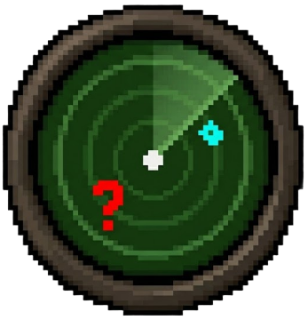

# Presence Checker Plugin

**Presence Checker** is a RuneLite plugin for Old School RuneScape designed to help clan leaders, event organizers, and officers instantly identify which clan members are absent from a gathering.

It automatically cross-references your current **Friends Chat (Clan Chat)** member list against the players physically present in your **local vicinity** to determine who is missing.

##  Key Features

###  Presence Detection
* **Vicinity Scan:** Instantly scans all loaded players in your area and compares them to your Friends Chat list.
* **Real-Time Updates:** Identifies members who are in the chat channel but **not** standing near you.

###  Side Panel Interface
* **Visual List:** Displays missing members in a clean, dark-themed scrollable list matching the RuneLite aesthetic.
* **Rank Icons:** Shows clan ranks (e.g., `[Gen]`, `[Sgt]`) next to names for quick hierarchy checks.
* **Clipboard Export:** A dedicated **"Copy All"** button lets you instantly grab the full list of absentees to paste into Discord, spreadsheets, or logs.
* **Quick Refresh:** Re-run the check instantly with the **Refresh** button.

###  In-Game Overlay (HUD)
* **Heads-Up Display:** A movable overlay on your screen shows the current count of missing members.
* **Detailed View:** Optionally lists the specific names of missing members directly on the overlay if the count is low (configurable).

###  Chat Integration
* **Commands:** Run checks via chat using the command `::absent`.
* **Chat Output:** (Optional) Prints the list of missing members directly to your game chat box for quick reference.

###  Visual Highlighting
* **List Highlighting:** Automatically highlights the names of missing members in **Purple** (or any custom color) directly inside the in-game Friends Chat list widget.

---

## ⚙️ Configuration

The plugin is highly customizable via the RuneLite configuration panel.

### General Settings
* **Message Color:** Customize the color of chat messages sent by the plugin.
* **Show Chat Messages:** Toggle whether results are printed to the game chat (Default: `OFF`).
* **Highlight Color:** Choose the color used to highlight missing members in the in-game clan list (Default: `Purple`).

### Chat Filters
* **Exclude Self:** Toggle whether to include yourself in the missing list (Default: `ON`).
* **Rank Filtering:** Individual toggles to **hide** specific ranks from the report. useful if you want to ignore missing Guests, Recruits, or specific officer ranks.
    * *Options:* Hide Owner, General, Captain, Lieutenant, Sergeant, Corporal, Recruit, Friend, Guest.

### Overlay Settings
* **Enable Overlay:** Toggle the on-screen HUD (Default: `ON`).
* **Show Names in Overlay:** List names of missing members on the screen instead of just the count.
* **Overlay Names Limit:** Set the maximum number of names to show before reverting to a simple count (Default: `5`).

---

##  How to Use

1.  **Install** the plugin from the RuneLite Plugin Hub (once submitted) or build it locally.
2.  Open the **Presence Checker** side panel (PC Icon).
3.  Click the **Refresh** button in the panel or type `::absent` in-game.
4.  View the list of missing members in the panel, on the overlay, or look for **highlighted names** in your Clan Chat tab.

